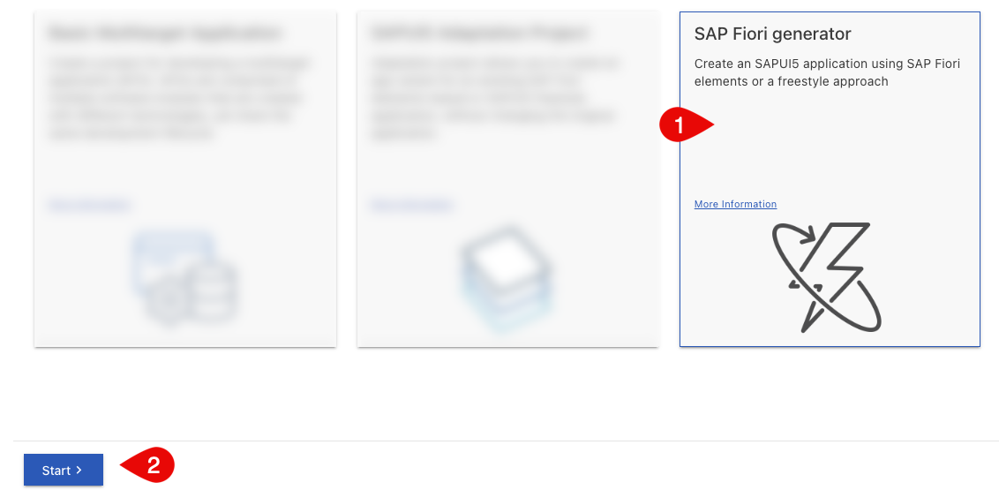
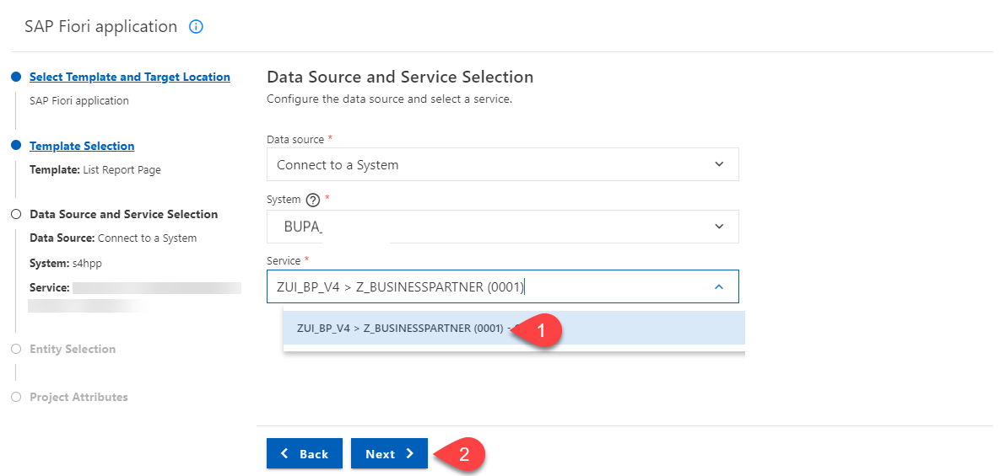
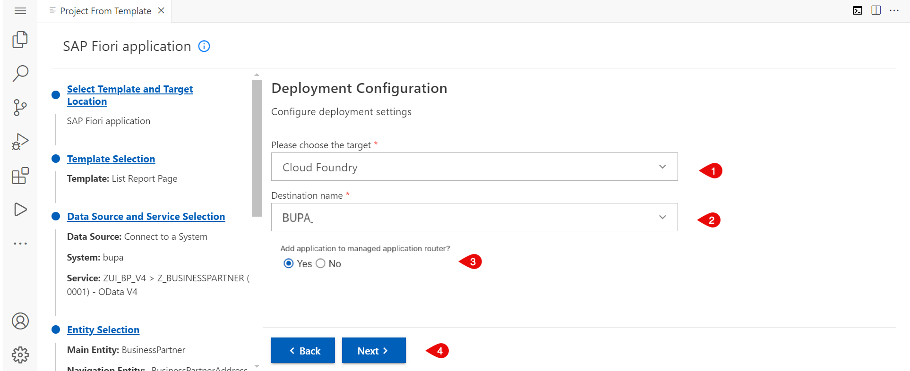

# Develop a HTML5 Cloud Application

## Introduction

SAP Business Application Studio comes out of the box with predefined set of development environments – Dev-Spaces (virtual machine on the cloud where you can develop, build, test and run using pre-installed runtimes and tools) tailored for developing SAP business scenarios.

Create a simple UI extension application in SAP Business Application Studio using existing project templates in order to consume the Business Partner OData service. This application will run as a stand-alone application without a SAP Lauchpad.

**Persona:** UX Developer

## Step-by-Step

### Open SAP Business Application Studio 

1. Login to your SAP BTP cockpit. 
2. Go to your Subaccount and choose **Services** and choose **Instances and Subscriptions**. 
3. Select the tab **Subscriptions**, look for **SAP Business Application Studio**, click the three dots **...** to open the relevant **Actions**. Choose **Go to Application** to open **SAP Business Application Studio**.

   
   
4. You would be prompted with a login screen of either default Identity Provider or custom Identity Provider depending on what you have configured.
5. Login to the Application using your default/custom Identity Provider credentials.

### Create a Dev workspace

1. Choose **Create Dev Space**.
2. Enter the name of the space and choose **SAP Fiori** and choose **Create Dev Space**.

   
  
3. Once the devspace is created, open the dev space which you created now.

### Login to Cloud Foundry in SAP Business Application Studio 

1. You have opened **SAP Business Application Studio** and created and opened a Dev workspace.
2. In the next step, we will log in to Cloud Foundry in **SAP Business Application Studio**, so let us copy the needed parameters in a text editor of your choice. 
3. Switch to the SAP BTP tab and choose **Overview** of the subaccount. Copy the **API Endpoint** and **Org Name** into a text editor of your choice. 

    

4. Choose **Spaces** and write down the space name as well to a text editor of your choice. 

    

5. Switch to the tab where you have opened **SAP Business Application Studio**. Let us customize the editor layout to show the **Menu Bar**. Choose **Customize Layout** on top right, toggle the visibilty of **Menu bar** by selecting it to On.
   
   
   
6. In the Main Menu, choose **View** > **Command Palette**.

	

6. Search for **CF Login** and select **CF: Login to Cloud Foundry**.

    
    
7. Enter CF API endpoint which you copied in step 3 or take the default suggested API endpoint.     
8. Enter your SAP BTP account **Email** and **Password** when prompted.

   

9. Select your Cloud Foundry **Org** which you have noted down in step 3. 
10. Select the space name which you have noted down in step 4. Once you have selected the Org and Space, you would login to Cloud Foundry in SAP Business Application Studio.
11. Now we have successfully created a workspace and pointed to our desired SAP BTP **Org** and **Space**.

   

### Develop the Application from Project Template

1. Choose **New project from Template** in the **Get Started** page to create the project. Alternatively, Go to main menu **File** > **New project from Template**.

   
    
2. In the **New Project From Template Wizard**, select **SAP Fiori application**. Choose **Start**.

   

3. In the **Template Selection**, select **List Report Page**. Choose **Next**.
   
     
   
4. In the **Data Source and Service Selection**, choose:
   - For the field **Data Source**, choose **Connect to a System** from the drop-down.
   - For the field **System**, choose the destination which you created for connecting to your on-premise system, in our case choose **BUPA**.
   - In the drop-down for the field **Service**, search **ZUI_BP** and select **ZUI_BP_V4 > Z_BUSINESSPARTNER (0001)**.
   - Choose **Next**.
  
     

   >If you get an error or you are been asked for credentials then your principal propagation setup seems not to be correct or your principal is wrong - check the [troubleshooting section](../../connectivity/README.md#troubleshooting) in the tutorial for the connection setup.   
   
5. In the **Entity Selection** screen, choose:
   - For the field **Navigation entity** choose **\_BusinessPartnerAddress** from the drop-down.
   - Select **No** at the selection.
   - Choose **Next**

      
      
6. In the **Project Attributes** screen:
   - For field **Module Name**, enter a meaningful name, for example **sapui5**.
   - For field **Application Title**, enter **S4HANA UI Extension**.
   - For field **Application Namespace**, choose **sap.btp**.
   - Leave the defaults for the **Project folder path**, your project will be created in a folder with the module name you have specified.
   - Select **Yes** for **Add Deployment Configuration**.
   - Select **Yes** to add **SAP Build Workzone (previously called as Fiori Launchpad**) Configuration.
   - Select **No** for **Configure advanced options**.
   - Choose **Next**.
 
     
   
7. In the **Deployment Configuration** screen:
   - Choose **Cloud Foundry** as Target.
   - **Destination Name** is prefilled as **BUPA**.
   - Select **Yes** to add the application to managed application router.
   - Choose **Finish** to finish the project creation or choose **Next** if you have opted to add **SAP Build Workzone (previously called as Fiori Launchpad**) configuration in step 6.

     

8. In the **Fiori Launchpad Configuration** screen we would configure the **SAP Build Workzone** configurations:
   - Enter **BusinessPartners** for **Semantic object**.
   - Enter **display** for **Action**.
   - Enter **Business Partners** for **Title**.
   - Enter **List of Business Partners** for **Sub-Title**.
   - Choose **Finish** to finish the project creation.

     
     
9. Once the project is generated, a popup comes up asking you to open the newly generated project folder, choose **Open folder** to open the created project **sapui5**. 

   

### Result

You have now configured a development workspace and created a HTML5 Application successfully. Next step we will test and then build and deploy the application.
